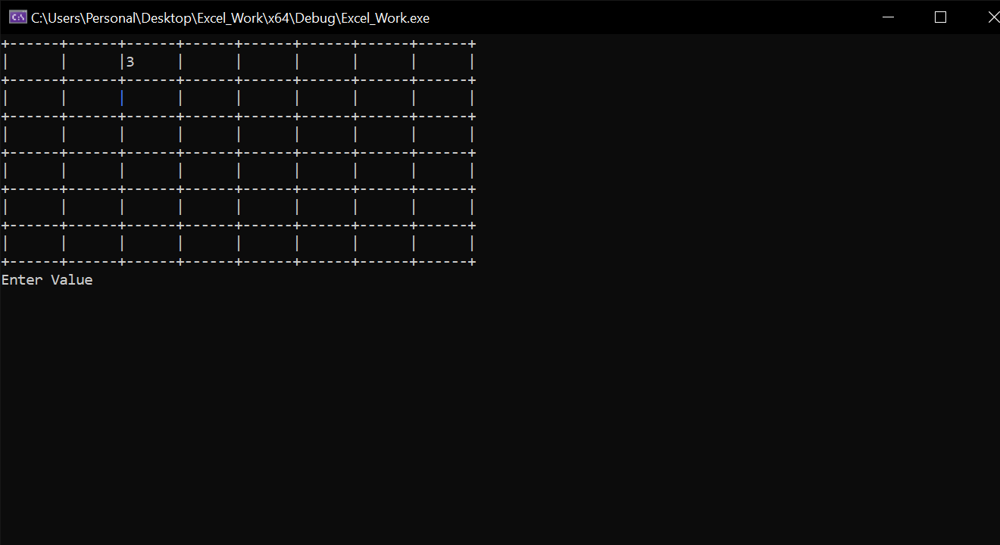

# Third Semester

My third semester projects.

1. Excel Sheet
2. DOS Shell with Notepad Integration

## Excel Sheet

### Overview

This is a  Command-Line Excel-Like Application that brings the  familiar functionality of Excel to the command-line interface, providing users with a versatile and efficient tool for data manipulation and  analysis, developed using C++. 

### Key Features:

##### **Cell-Based Data Entry:**

 The application allows users to input and manipulate data in a  cell-based format, mirroring the structure of traditional Excel  spreadsheets. Users can easily navigate through cells, input values, and perform calculations using simple commands('A').

**Formulas and Functions:**

 Similar to Excel, the application supports the use of formulas and  functions. Users can create complex calculations by referencing cells,  performing arithmetic operations, and utilizing built-in functions. This feature enhances the application's utility for data analysis and  computation.

##### **Cell Referencing and Ranges:**

 Users can reference cells and define ranges within the command-line  interface, facilitating the creation of dynamic and interconnected  datasets. This feature enables users to build relationships between  different parts of the dataset, enhancing the flexibility and power of  data analysis.

##### File Handling:

Users can save there excel sheet and reload there sheet to continue work on it without loosing there previous data.

### Data Structure

##### linked_list :

Quard Linked_list (having four links, Up,Down,Left,Right) is used to manage connections between cells. 

##### Vectors:

2D vectors to handle Cut,Copy and Paste functionality.

 

------

# DOS Shell with Notepad Integration

*An advanced command-line interface and text editing environment*

### Overview

Welcome to the DOS Shell with Notepad Integration project, a powerful  blend of classic DOS functionality and modern text editing capabilities. This project aims to provide users with a feature-rich and seamless  experience for file management, virtual drive operations, and text  editing.

## Key Features

##### Command-Line Interface (CLI):

Emulates the classic DOS environment with versatile commands for file management, directory navigation, and virtual drive operations.

##### Integrated Notepad Application:

 Seamlessly edit and manage text files using a custom-built Notepad application within the command-line interface.

##### **Efficient Data Structures:**

 Utilizes trees, linked lists, and vectors for optimized file system management, ensuring fast and organized access to stored information.

##### File Handling:

## DOS Shell Commands

##### **ATTRIB:** 

Displays file attributes.

##### MKDIR:

 Creates a virtual directory.

##### Change Directory Functions:

CD (Change Directory):

`CD`: Displays or changes the current directory.

`CD.`: Prints the working directory.

`CD..`: Changes directory to the previous directory.

`CD\`: Changes directory to the root directory (e.g., V:>).....

and many more (can see in Help Function of Project).

## Notepad Functionalities

The integrated Notepad application boasts a range of text editing features, including:

- Inserting an alphabet/number.
- Deleting the next alphabet/number.
- Backspacing (delete previous alphabet/number).
- Appending at the end of the line/file.
- Multiline text support.
- Cursor movement (up, down, left, right).
- Redo (last 5 operations).
- Undo (last 5 operations).

### **File Handling in DOS Shell with Notepad Integration:**

File handling plays a pivotal role in the seamless functioning of the DOS Shell with Notepad Integration project. In the integrated Notepad application, user data is meticulously saved into files, preserving the edits and modifications made during text editing sessions. When a file is reopened, users can conveniently retrieve their previously saved data, ensuring continuity and ease of access.

On the other hand, the DOS Shell takes file handling to a more intricate level by persistently storing the entire tree structure of virtual folders and files. This is made possible by the `LOADTREE` command, allowing users to reload their entire directory hierarchy effortlessly. Whether it's virtual directories or files, every element created using DOS Shell commands can be retrieved, enabling users to seamlessly continue their work with a familiar and organized file structure. The file handling capabilities in both Notepad and DOS Shell enhance user productivity and data management, creating a cohesive and user-friendly experience.

